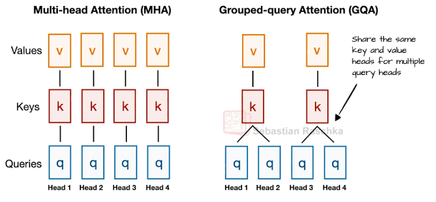
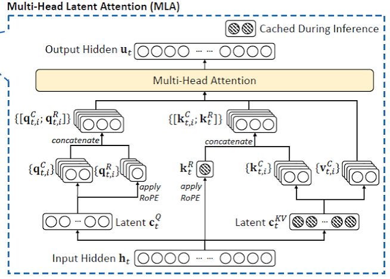

# `mla` — Multi-head Latent Attention vs. Grouped Query Attention

## Motivation

The baseline uses GQA for attention. The major idea behind GQA is to have shared key and value matrices for a group of heads to reduce the KV cache during inference. GQA gives smaller KV caches than Multi-Head Attention and better results than Multi-Query Attention, where all heads share a single key and value matrix. The image below gives an visual understanding. The image credits to Sebastian Raschka whose blog is also really great, I recommend people to follow him.

GQA although gives weaker performance when compared to Multi-head Attention since the key and value matrices are shared that reduces its capabilities.

DeepSeek introduced Multi-head Latent Attention in their paper **DeepSeek-V2: A Strong, Economical, and Efficient Mixture-of-Experts Language Model** (https://arxiv.org/pdf/2405.04434). I strongly recommend going through this paper.

MLA has two major tricks:
1. Low-rank compression
2. Inference-time fusion trick

Each token is projected down into a joint low-rank latent `c_kv` shared by keys and values, and a separate latent `c_q` for queries, across all heads in a Transformer block. Q, K and V are then up-projected back out of these latents. Instead of caching per-head K and V, we cache only `c_kv`, which cuts KV cache storage significantly.
Compressing Q buys something different. Queries are ever cached at inference, so `c_q` is purely a training-time saving on stored activations.

Crucially, every head still gets its own K and V. They just share the latent, and each head applies its own up-projection to it. So unlike GQA, MLA constrains the *rank* of the shared source rather than the *count* of distinct K/V.

The memory savings would be wasted if we had to reconstruct full K and V at every decoding step. The fusion trick helps us avoids this. Since the up-projections from latent to K and V are linear, they can be folded algebraically into the matrices next to them instead of applied explicitly.
The score becomes `q · kᵀ = (c_q * W_UQ) * (c_kv * W_UK)ᵀ = c_q * (W_UQ * W_UKᵀ) * c_kvᵀ`. Since `W_UQ` and `W_UK` are fixed after training, their product is computed once per head; we then only need `c_kv` in cache and never reconstruct per-token keys.
Similarly `Σ attn · (c_kv * W_UV) = (Σ attn · c_kv) * W_UV`, so we sum latents first and up-project once at the end. The model never materializes per-head K or V during decoding.

This fusion trick has a catch. Since we no longer have explicit Q and K matrices at inference and just weights and latents, we can't apply RoPE which is the canonical way of encoding position in LLMs at the moment. DeepSeek worked around this with a small decoupled rotary component (`r_q`, `r_k`) kept outside the compression and is later concatenated onto content component, splitting the score additively into `(q_up·k_up) + (q_r·k_r)`. So every query and key has a content component and a rotary component.

This branch swaps GQA for MLA to understand, hands-on, how joint low-rank K/V compression compares to GQA's head-sharing approach.

## What changed

`train_gpt.py`'s attention block was reworked from GQA's q/k/v projections to MLA's low-rank latent projections. (Note on naming: this branch reuses `c_q`/`c_k` for the *down* projections, so they do not mean the same thing as the baseline's projections of the same name.)

- `c_q`, `c_k` — down-project into the query latent (`Q_latent_dim`) and the joint K/V latent (`K_latent_dim`)
- `u_q`, `u_k`, `u_v` — up-project the latents back out to per-head dimensions
- `r_q`, `r_k` — a separate small rotary component carrying decoupled RoPE, since RoPE doesn't commute with the low-rank compression and has to be applied outside it. `r_k` is shared across heads; `r_q` is per-head.
- Q and K are formed as `cat([content, rotary])`, so scores split additively as `q·k = (q_up · k_up) + (q_r · k_r)`
- V is padded from `head_dim` (64) up to `head_dim + rotary_dim` (96) so that the FlashAttention kernel sees matching head dims. The padded columns are zeros and contribute nothing and the output is sliced back to 64.
- Run 3 additionally introduced gradient clipping and RMS norm on the  q/k since the loss shot up.

This is the **training-time** path — full expand-and-concat attention. The KV-cache fusion trick is not implemented, as it's an inference-time optimization out of scope for this training harness.

## Parameter count

Config: `model_dim=512`, `num_heads=8`, `head_dim=64`, `latent_dim=64` (→ `Q_latent_dim=32`,
`K_latent_dim=64`, `rotary_dim=32`), `mlp_mult=2`, `num_layers=9`, `vocab_size=1024`, tied
embeddings.

### MLA

| Tensor | Shape | Params |
|---|---|---|
| `c_q` | 512 * 32 | 16,384 |
| `c_k` | 512 * 64 | 32,768 |
| `r_q` | 32 * (32*8) | 8,192 |
| `r_k` | 512 * 32 | 16,384 |
| `u_q` | 32 * (64*8) | 16,384 |
| `u_k` | 64 * (64*8) | 32,768 |
| `u_v` | 64 * (64*8) | 32,768 |
| **MLA projections subtotal** | | **155,648** |
| `proj` | 512 * 512 | 262,144 |
| **Attention total** | | **417,792** |
| MLP (`fc` + `proj`) | 512*1024 + 1024*512 | 1,048,576 |
| Block scalars (`attn_scale`, `mlp_scale`, `resid_mix`) | | 2,048 |
| **Transformer block** | | **1,468,416** |

9 blocks = 13,215,744 · embedding (1024 * 512, tied) = 524,288 · `skip_weights` = 2,048
**Total = 13,742,080**

### GQA baseline

| Tensor | Shape | Params |
|---|---|---|
| `q_proj` | 512 * (64*8) | 262,144 |
| `k_proj` | 512 * (64*4) | 131,072 |
| `v_proj` | 512 * (64*4) | 131,072 |
| **Q/K/V subtotal** | | **524,288** |
| `proj` | 512 * 512 | 262,144 |
| **Attention total** | | **786,432** |
| MLP | | 1,048,576 |
| Block scalars | | 2,048 |
| **Transformer block** | | **1,837,056** |

9 blocks = 16,533,504 · embedding = 524,288 · `skip_weights` = 2,048
**Total = 17,059,840**

### Comparison

Excluding the output projection (shared by both), MLA's Q/K/V machinery is **155,648 vs GQA's
524,288 — about 30%**. Overall MLA runs at **80.5% of the baseline's parameters**.

## KV cache: the thing MLA is actually for

Cache footprint per token per layer, in values:

| Attention | Cached per token/layer | Full 1024-token context, 9 layers | vs GQA |
|---|---|---|---|
| MHA (8 heads) | 8 * 64 * 2 = 1,024 | 9.4M | 2* larger |
| **GQA (4 kv heads)** | 4 * 64 * 2 = 512 | 4.7M | — |
| **MLA** (`c_kv` 64 + shared `k_r` 32) | 96 | 884K | **5.3* smaller** |

This is analytic, not measured but it's the reason MLA exists, and it reframes the bpb results below: MLA is trading a small quality loss for a 5.3 times smaller cache at 80% of the parameters.

## Fairness of the comparison

- **Parameter count.** MLA is *smaller* with the counts being 13.7M vs GQA's 17.1M. The comparison is therefore biased against MLA, and any bpb gap should be read as an upper bound on the true architectural gap rather than a clean loss.

- **Query compression is far more aggressive than the paper.** `Q_latent_dim = latent_dim // 2 = 32` against `d_model = 512` is a 16* compression. DeepSeek-V2 uses roughly 3* (1536 from 5120). 
The K/V ratio here (8*) is close to their ~10x, but the query bottleneck is a serious confound and the most likely single explanation for the bpb gap.

## Setup

Single H100 (Runpod), same `sp1024` FineWeb data/tokenizer as the baseline.

Three configurations: one capped at 10 minutes regardless of iteration count (the challenge-legal
setup), and two run for fixed iteration counts with no time limit (5000 and 2000) (diagnostic).

Runs 1 and 2 shared settings. Run 3 introduced gradient clipping and RMS norm on u_q/u_k after we observed loss divergence post 1000 iterations.
Ideally these would have been separate runs to isolate causality, but compute constraints didn't allow it.

## Results

| Config | Attention | Val bpb | Model params | Iterations | Wallclock | Notes |
|---|---|---|---|---|---|---|---|
| `GQA_baseline_10_mins` | GQA | ~1.34 | 17,059,840 | 1,173 | 10 mins | Baseline, challenge-legal |
| `mla_run_10_mins` | MLA | ~1.43 | 13,742,080 | 1,056 | 10 mins | +11% step time |
| `mla_run_5000_iters` | MLA | ~2.51 | 13,742,080 | 5,000 | 50 mins | Diverged — no grad clipping or norm |
| `mla_run_2000_iters` | MLA | ~1.37 | 13,742,080 | 2,000 | 23 mins | GC + norm stabilized it |
| `GQA_baseline_2000_iters` | GQA | ~1.32 | 17,059,840 | 2,000 | 17 mins | Baseline for 2000 iters |

## Takeaways

- **GQA won on bpb by ~4%** (1.32 vs 1.37) at 2000 iterations but with 24% more parameters. MLA reached within 4% on 80% of the budget, so the architectural gap is smaller than the raw number suggests.

- **MLA's cache is 5.3x smaller.** The bpb loss buys a large inference-time win that this
  training-only harness never exercises. Judged on what MLA is designed for, this is not a loss.

- **The MLA runs slower than GQA** MLA was 11% slower than GQA in the 10-minute run (0.57 vs 0.51 secs/iter). MLA has more steps and smaller parameter count in its Attention than GQA. 
The padded V and concatenated Q, K increase the head dim by 50% and the multiple kernel launches for 7 matmuls in MLA over 3 matmuls in GQA increases the time per step in MLA.

- **Loss diverged without clipping/norm.** Worth noting the low-rank bottleneck may make this setup more sensitive to gradient scale than the GQA baseline, though with both fixes landing in one run we can't attribute it.

## Open questions / next steps

- **Match the parameter count.** `LATENT_DIM=128` puts MLA at ~15.3M against GQA's 17.1M — much closer to parity. This is the single most valuable rerun.
- **Fix the query bottleneck.** `Q_latent_dim` is hard-wired to `latent_dim // 2`. Decouple it and test a ~3* compression ratio matching the paper, holding K/V rank fixed.
- **Decouple `rotary_dim` from `latent_dim`.** Currently all three latent sizes move together, which confounds "how much does K/V rank matter" with "how much does rotary width matter."
- **Sweep `latent_dim`** to find where the param-count/bpb tradeoff curve bends.
- **Run to convergence.** All results here are from very early training; the ordering may not hold.

- Sebastian Raschka has noted MLA works better in larger models while GQA holds up better in small parameter regimes. Where does the crossover start? This 13M-param setting may simply be on the wrong side of it.